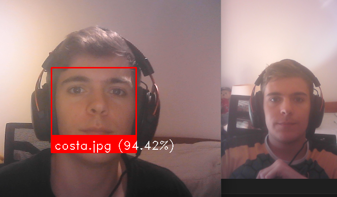

<p align="center">
  
</p>

<h1 align="center">Facial recognition</h1>

Live facial recognition program. 

Using pictures and a camera from your computer compare them and put a frame over your face with the accuracy.



Installation
===
Recommend using miniconda

### Ubunto
1. Install the requeriments with:
```
pip install dlib opencv-python face_recognition
```

2. To check the associated cameras with your computer:
```
v4l2-ctl --list-devices
```
3. Run the code:
```
python3 main.py
```

### Windows
1. Install [dlib](https://gist.github.com/nguyenhoan1988ed92d58054b985a1b45a521fcf8fa781)

2. Install the requeriments with:
```
pip install opencv-python face_recognition
```

3. Run the code:
```
python3 main.py
```

### Warning
Carefull using Wsl2 it probably won't recognise the camera
